# 教室で使えるかもしれないもの作り #◯ 「今日は何を着よう」で朝を削らない。手持ちの服だけで考えるクローゼット帳アプリ「デジタルワードローブ」

## 🏫 はじめに

朝、クローゼットの前でしばらく動けなくなること、ありませんか。

昨日と同じ服はさすがに気が引ける。今日は参観日だから少しきちんとしたい。でも下に何を合わせたか思い出せない。そうやって迷っているうちに五分が過ぎて、結局いつもの一着に手が伸びる。教室に着いてから「またこれか」と気づく。

先生の朝は、家を出るまでがすでに仕事です。連絡帳の返事、子どもの支度、忘れ物の確認。そのうえで服まで考えるのは、正直しんどいと思います。

そして服の悩みは、朝だけでは終わりません。似たような黒いカットソーが気づけば三枚ある。奥のほうに、去年から一度も袖を通していないニットが眠っている。買ったときは高いと思ったコートが、はたして元を取れているのか分からない。

今回つくったのは、教室で子どもたちが使うものではありません。先生ご自身のための、小さなクローゼット帳です。持っている服を写真で登録しておくと、何を持っていて、いつ着て、何と合わせたかが、ひとつづきの記録になります。朝に迷う時間を、ほんの少しでも減らせたらと思ってつくりました。

服のことは、自分でどうにかすればいい類の悩みです。誰かに相談することでもありません。だからこそ、ずっと手つかずのまま毎朝くり返されているのだと思います。手つかずのまま残っているものこそ、道具で減らせる余地があるはずだと考えました。

ひらくのはこちらです。

https://digitalcloset.giga-school.com/

会員登録もログインもありません。ひらいたその場から使えます。

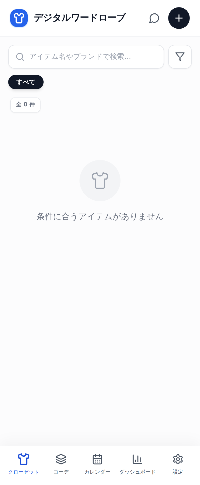

はじめてひらいたところ。ここに手持ちの服が並んでいきます。

## 📱 このアプリでできること

やることは、服を一着ずつ写真で登録していくだけです。

右上の丸いボタンから、その場でカメラで撮るか、すでに撮ってある写真を選びます。あとは名前とカテゴリ、色、季節、素材、買った年、値段を入れて保存します。名前だけは必ず入れてもらいますが、あとの欄は空でもかまいません。あとから足せます。

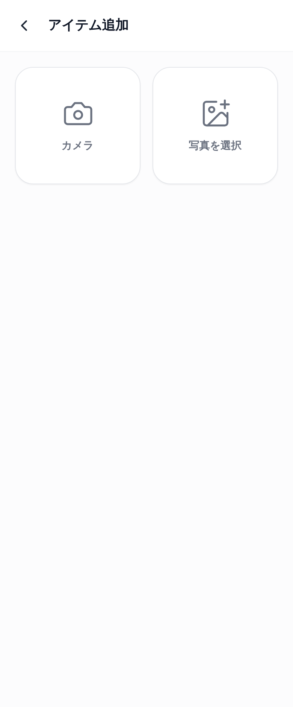

カメラで撮るか、端末に入っている写真から選ぶかを決めます。

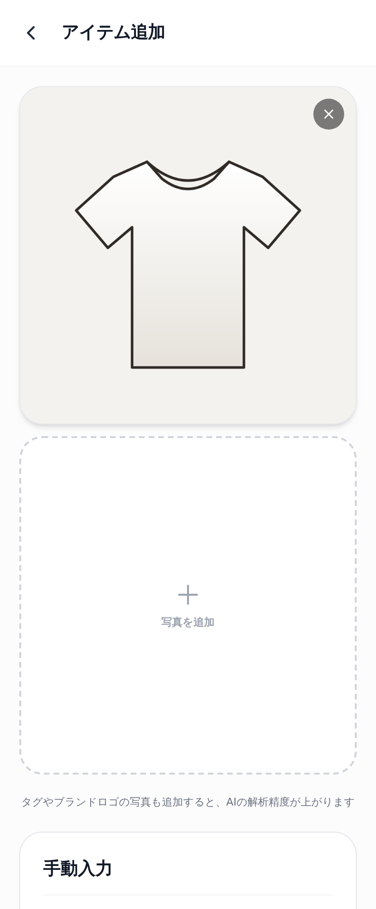

一度に何枚でも選べます。左上に「メイン」と付いた一枚目が、一覧に出る写真になります。

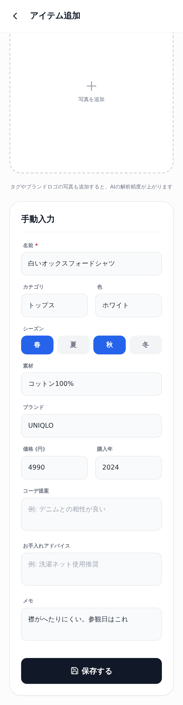

季節はボタンを押して選びます。春と秋のように、いくつでも選べます。

登録するときに全部の欄を埋めようとしなくて大丈夫です。あとから何度でも直せますし、思い出せないところは空のままにしておけます。はじめから完璧にそろえようとすると、たいてい三着目でやめてしまいます。まず名前と写真だけで並べてしまって、気が向いたときに値段や素材を足していくくらいが続くと思います。

写真は取りこんだ時点で自動的に小さくしています。長い辺が八百ピクセルになるまで縮めてから保存するので、何十着登録しても端末が重くなりにくいはずです。ここは迷ったところで、きれいなまま残したい気持ちもありましたが、毎日ひらくものが重くなるほうが致命的だと考えて、小さくするほうを選びました。

なお、この記事に載せている画面の写真は、説明のためにイラストを登録したものです。実際にはカメラで撮った服の写真がそのまま並びます。

登録が進むと、こんなふうに二列で並びます。

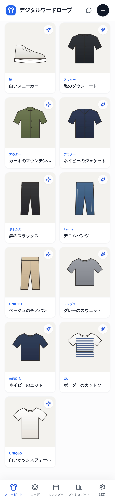

持っている服の一覧。上に出ている件数で、いま何着あるかがすぐ分かります。

服が増えてくると、探すほうが大変になります。そこで、名前とブランドで検索できるようにしました。上の帯を押せばカテゴリだけで絞れますし、右のボタンからは、カテゴリと色と季節と買った年の四つで細かく絞りこめます。並べ替えは、登録した順と値段の順と名前の順で、それぞれ昇り降りの六通りです。

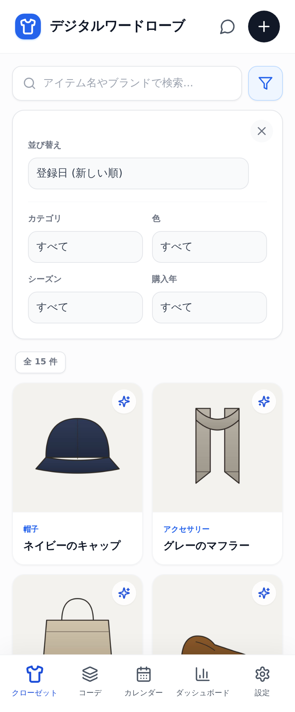

四つの条件と六通りの並べ替え。使わないときは閉じておけます。

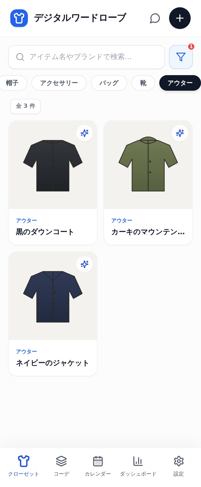

上の帯を押すだけでも、そのカテゴリだけになります。

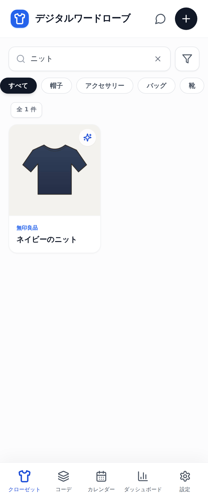

「ニット」と打てば、名前かブランドに当てはまる服だけが残ります。

絞りこみをここまで用意したのは、季節の入れかえのときに効いてほしかったからです。衣がえの前に、冬のものだけを並べて眺める。買った年の古い順に並べて、そろそろ手放すものを考える。そういう使いかたを想定しました。

## 📅 着た日を残すと、持っている服が数で見えてきます

このアプリの中心にあるのは、実はカレンダーだと思っています。

「その日に何を着たか」を残しておくと、あとから効いてきます。日付を押して、着た服を選ぶだけです。一日に何着でも登録できるので、上と下と靴とかばんまで残せます。まちがえたら、記録の右のごみ箱から一件ずつ消せます。

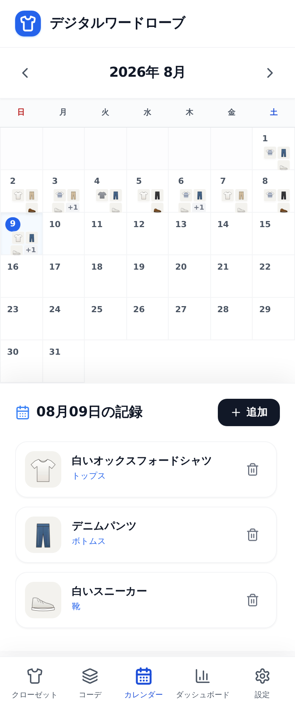

日付のマスに、その日に着た服の写真が小さく並びます。

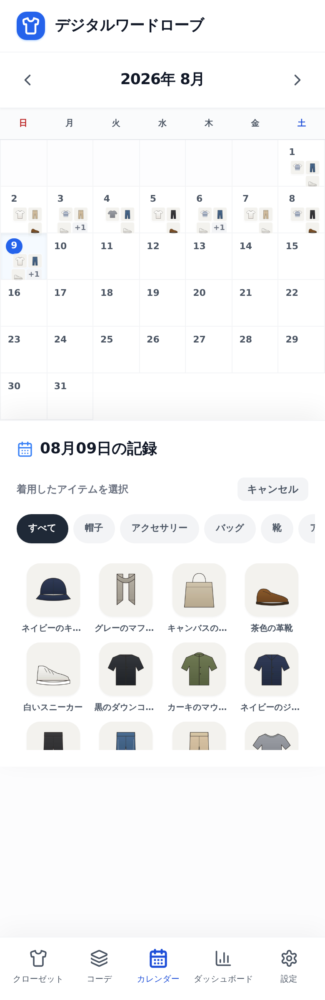

カテゴリで絞ってから選べるので、点数が増えても探し回らずに済みます。

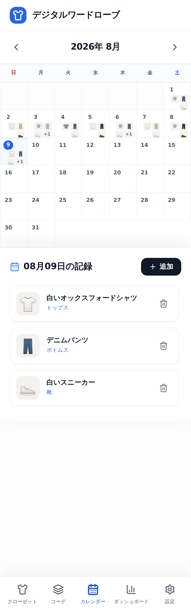

登録した服が下に並びます。ここから一件ずつ消すこともできます。

記録を残すのは面倒なことです。だからここは、日付を押して服を押すだけの二手で終わるようにしました。一日ぶんを十秒で終えられないと、三日で続かなくなると思ったからです。帰宅してから、その日に着たものを押していく。それだけで十分です。まとめて何日ぶんか入れることもできます。

そして、ためた記録はダッシュボードに集まります。持っている点数と金額、よく着ている服の上位五点、カテゴリごとの割合が一枚の画面になります。

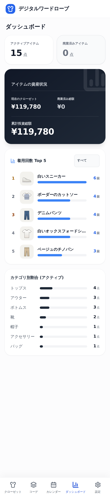

よく着ている服の上位五点は、カテゴリで絞りこむこともできます。

ここを見ると、ふだん頭のなかにあった感覚が数字になります。上位に同じ服ばかり並ぶなら、それはあなたにとって着心地のよい一着ということです。逆に、何か月ぶんの記録をためても一度も出てこない服があるなら、それは持っていることを忘れている服かもしれません。

一着ずつの画面には、着た回数と、一回あたりいくらになったかが出ます。値段を着た回数で割っただけの、単純なものです。

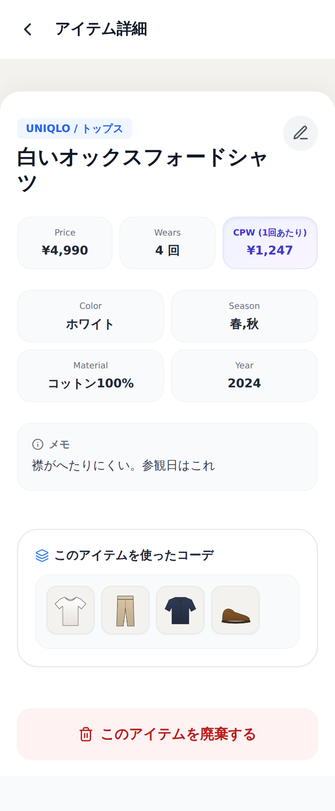

一回あたりの金額は、着るほど下がっていきます。高かった服が元を取れているかの目安になります。

この数字を入れるかどうかは迷いました。服にお金の話を持ちこむのは、少し無粋だとも思ったからです。それでも入れたのは、高かった一着を大事にしまいこんで着ないままにするより、着るきっかけになったほうがいいと思ったからです。数字が下がっていくのは、単純に気分がいいものです。

組み合わせも残せます。二着以上を選んで保存すると、マイコーデとしてまとまります。星を五段階でつけられるので、うまくいった組み合わせに印を残しておけます。

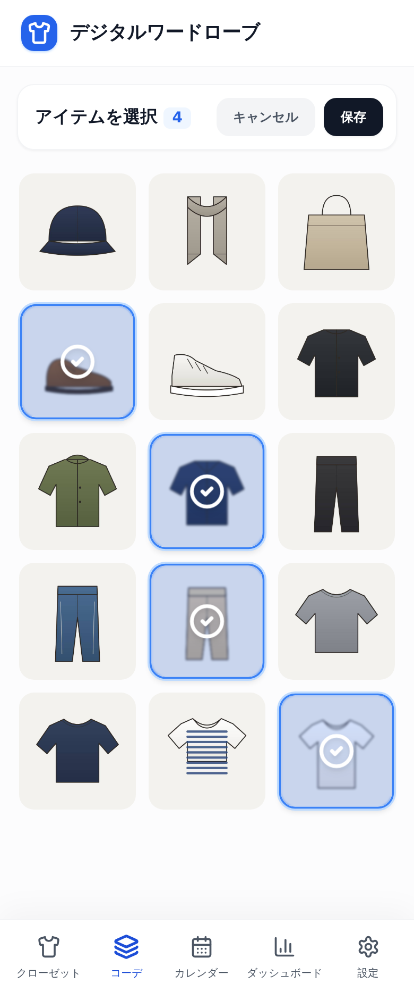

押して選ぶだけです。二着以上でないと保存できないようにしてあります。

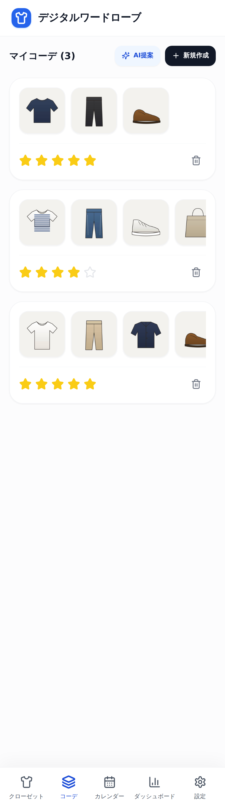

星をつけておくと、あとで見返したときに迷いません。

保存した組み合わせは、一着ずつの画面にも出てきます。「このシャツ、前は何と合わせたんだっけ」が、その場で分かります。朝の五分は、たいていここで消えていると思うのです。

## 🤖 AI に相談できます。使う鍵はご自分のもの

写真から服の情報を読みとったり、コーデを提案したりする機能もあります。ただし、これは使いたい方だけが使えばよい部分です。

まず前提をはっきり書いておきます。AI の機能は、ご自分で用意した鍵を設定に入れたときだけ動きます。鍵はアプリの中には入っていません。そして鍵を入れなくても、登録も記録もふりかえりも、ここまで書いたことは全部使えます。

なぜこうしたかというと、無料で配るものに勝手な仕組みを持たせると、使う人の知らないところでお金や情報が動くことになるからです。自分の鍵を自分で入れる形にすれば、どこに何を渡しているかがはっきりします。

鍵を入れると、写真を選んだときに「AIで解析」が出るようになります。押すと、名前や色、素材、季節、おおよその値段までを埋めてくれます。

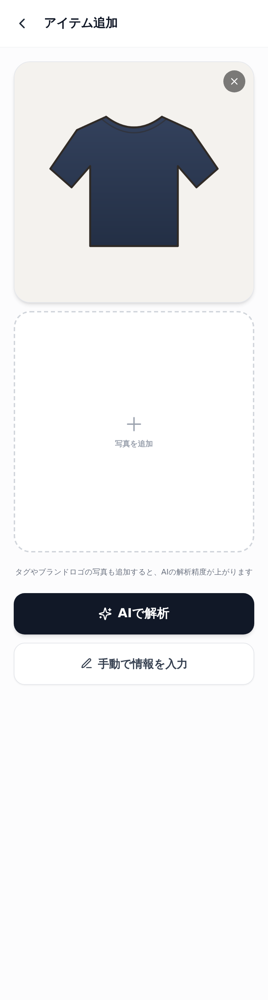

押すまで始まりません。タグやブランドのロゴが写った写真もいっしょに渡すと、読みとりの精度が上がります。

大事なのは、読みとった結果がそのまま保存されるわけではないことです。入力欄に入った状態で出てくるので、目を通して、違うところを直してから保存します。色や素材はけっこう間違えます。確認してから残す形は、崩さないようにしました。

コーデの提案もできます。基準にする一着と「少し寒めの日」のような要望を渡すと、最大三通りの組み合わせを出してくれます。

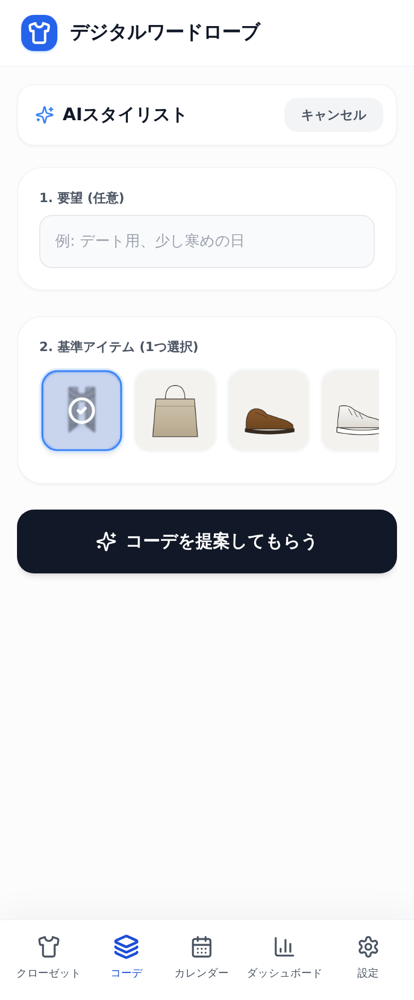

提案に使われるのは、登録してある服だけです。持っていない服は出てきません。

ここは作るときにいちばん気をつけたところです。世の中のおすすめは、たいてい「これを買いましょう」に着地します。それでは、朝の困りごとは解決しません。だから、手持ちの中だけで考えるようにしました。返ってきた答えのうち、手元にない服が混ざっていたら、保存する前に落としています。

相談の窓口もあります。一覧の右上の吹きだしから開くと、三つの使い方が選べます。ふつうに相談するもの、買おうか迷っている服の写真を渡して手持ちと見くらべてもらうもの、気になったコーデの写真を渡して手持ちで再現できないか探してもらうものです。

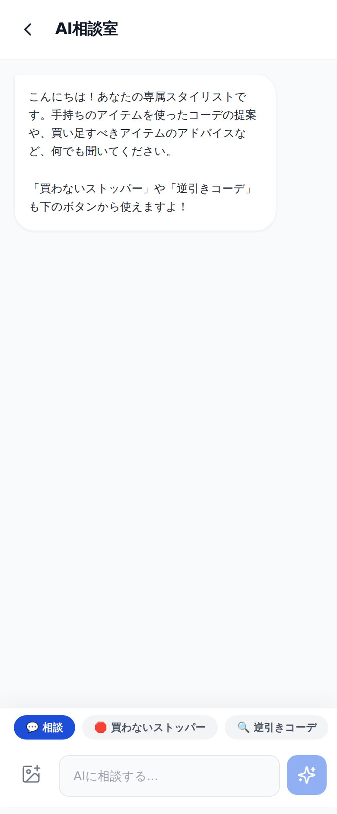

下のボタンで使い方を切りかえます。写真が要るものは、写真がないと送れないようにしてあります。

ふつうの相談では、明日の天気に合わせて何を着ればいいかといったことを聞けます。写真を添えることもできます。手持ちの服と、星を四つ以上つけた組み合わせを踏まえて答えが返ってきます。好みの傾向として渡しているのは、その星の高い組み合わせです。

買おうか迷っている服を見てもらう窓口は、半分は自分のためにつくりました。似たようなものを持っているのに、また似たものを買ってしまう。それを止めてくれる相手が、手持ちの一覧を全部知っているというのが、この仕組みのいいところだと思っています。

## ✨ 導入のメリット

三つのいいことが期待できます。

一つ目は、朝に決める時間が短くなることです。前に何と合わせたかが残っていれば、思い出す作業がなくなります。星をつけた組み合わせがあれば、迷ったときはそこから選べばよくなります。決めることの数が減るのは、忙しい朝にはそれだけで効くと思います。

二つ目は、持ち物がはっきりすることです。何を持っているかが二列に並ぶだけで、似たものを重ねて買うことは減るはずです。着た回数の記録がたまれば、出番のない服も見えてきます。手放すかどうかを決める材料が、感覚ではなく記録になります。

三つ目は、服にかけたお金と向き合えることです。一回あたりの金額が出るので、高かった一着をしまいこむより着るほうに気持ちが向きます。買うか迷ったときに、手持ちと見くらべてから決められるのも、長い目で見れば効いてくると思います。

そのぶんの余白が、子どもと向き合う時間に回ればいいなと思ってつくりました。

## 🛠️ 【管理者向け】導入手順

このアプリは、学校の端末に入れるものではなく、先生ご自身の端末で使うものです。それでも、情報担当の先生に聞かれそうなことを先に書いておきます。

入れる作業は要りません。ブラウザで開くだけです。

写真も記録も、使っている端末の中だけに残ります。どこかのサーバーに送られることはありません。他の人が見ることもできません。そのかわり、別の端末とは共有されません。スマートフォンで登録した服は、パソコンには出てきません。

名前や住所を入れる欄はありません。会員登録もログインもありません。

AI の機能を使うときだけ、外へ問い合わせが出ます。宛先は Google の一か所だけで、アドレスは generativelanguage.googleapis.com です。校内の回線でここが止められていると、AI の機能だけが使えません。それ以外の機能は問題なく動きます。渡るのは、送った写真と質問、それに手持ちの服の一覧です。名前や色といった登録内容が渡ります。

このアプリが外へつなげる先は、この一か所に限ってあります。ほかの宛先へは、仕組みのうえで届かないようにしてあります。

共用の端末で使うのはおすすめしません。記録はその端末のブラウザの中に残るので、他の人も同じ画面を開けてしまいます。ご自分のスマートフォンか、ご自分だけが使う端末で使ってください。

ブラウザの「閲覧履歴の削除」でサイトのデータまで消すと、登録した服もいっしょに消えます。iPhone と iPad は、しばらく開かない状態が続くと設定の一部が消えることがあります。大事な記録は、ときどき書き出しておくのが安全です。書き出しかたはこのあとに書きます。

ホーム画面に追加しておくと、ブラウザのバーが消えて画面が広く使えます。電波が届かないところでも、登録済みの服は見られます。追加のしかたは端末によって違います。Android やパソコンの Chrome なら、設定の画面に「ホーム画面に追加する」が出てくるのでそれを押します。iPhone と iPad は Safari の共有ボタンから「ホーム画面に追加」を選びます。

新しい版が出たときは、画面の下に案内が出ます。押すまで切りかわりません。服の登録や相談の途中で画面が入れかわると、打ちかけの入力が消えてしまうためです。

文字の濃さと、押せる場所の大きさは、実際のブラウザで測って直してあります。読みにくい文字や、押しにくい小さなボタンは残っていないはずです。指で広げれば拡大もできます。

## 📖 【利用者向け】使い方のガイド

はじめの一着を登録するところまでを書きます。

1. https://digitalcloset.giga-school.com/ をひらきます
2. 右上の「＋」を押します
3. 「カメラ」でその場で撮るか、「写真を選択」で端末の写真から選びます
4. 名前を入れます。ここだけは必ず要ります
5. カテゴリと色を入れます。欄を押すと候補が出るので、そこから選べます
6. 季節のボタンを押します。いくつ選んでもかまいません
7. 値段と買った年を入れておくと、あとで一回あたりの金額が出ます
8. 「保存する」を押します

これを何着かくり返します。全部を一度にやろうとせず、よく着るものから十着ほど入れると、その日から使えるようになります。

着た日を残すときは、次のようにします。

1. 下の「カレンダー」を押します
2. 日付を押します
3. 「追加」を押して、その日に着た服を押します
4. 何着でも登録できます。まちがえたら右のごみ箱から消します

組み合わせを残すときは、次のようにします。

1. 下の「コーデ」を押します
2. 「新規作成」を押します
3. 合わせたい服を押して選びます。二着以上えらびます
4. 「保存」を押します
5. 星を押して、五段階で印をつけます

着なくなった服は、詳しい画面のいちばん下から手放せます。

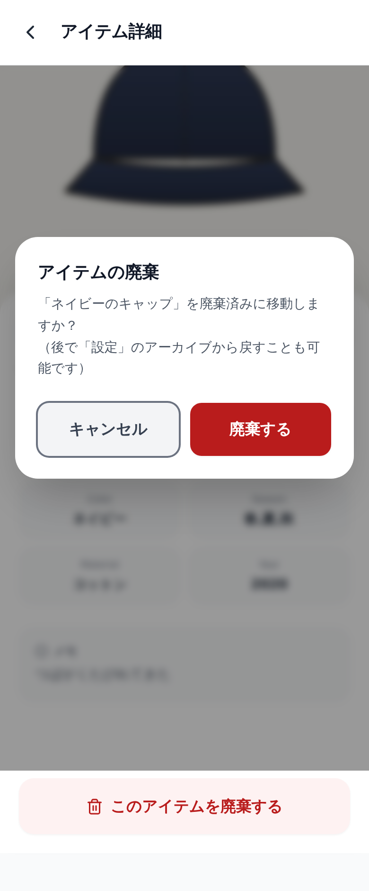

押すとすぐに消えるわけではありません。確認が出ます。

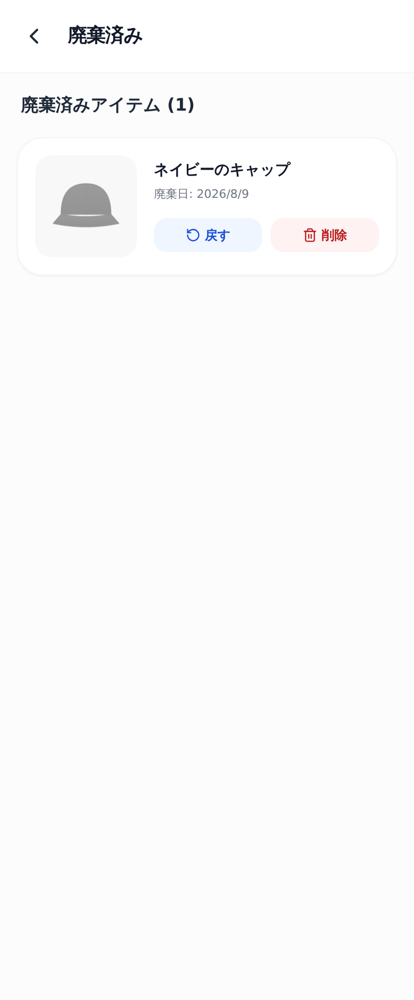

廃棄済みに移るだけなので、いつでも戻せます。

完全に消えるのは、この一覧でもう一度「削除」を選んだときだけです。二段構えにしたのは、勢いで消してしまった記録は取り返せないからです。廃棄した服も、これまでにかけた金額としては残ります。

記録は書き出しておけます。

1. 下の「設定」を押します
2. 「データ管理」の「エクスポート」を押します
3. 保存されたファイルを、なくさないところに置いておきます

端末を変えたときは、新しい端末で同じ画面から「インポート」を押して、そのファイルを選べば戻ります。読みこんでも、いま入っている記録は消えません。足す形で戻ります。

うまくいかないときに多いのは、次の二つだと思います。画面が真っ白になったときは、いちど閉じて開き直してください。AI の機能が使えないと出るときは、鍵を入れていないか、その日の回数の上限に達しています。しばらく待ってからもう一度試してください。

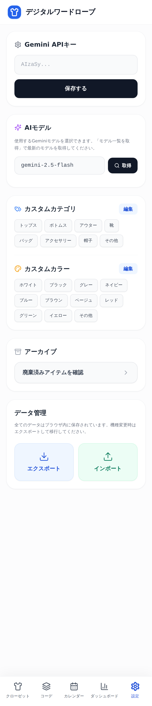

カテゴリと色の候補は、自分で書きかえられます。はじめはカテゴリが八つ、色が十一入っています。

カテゴリの候補は、そのまま使ってもいいですし、自分の持ち物に合わせて書きかえてもかまいません。ここを自由にしたのは、人によって持っているものの分けかたが違うと思ったからです。和服が多い方も、作業着が多い方もいます。

## 📝 まとめ

服のことなんて、と思われるかもしれません。子どもの話でも授業の話でもないので、この連載のなかでは変わり種です。

それでも、朝の五分は本当に貴重だと思うのです。その五分があれば、連絡帳にもう一言書けます。今日の一時間目の板書を、もう一度だけ見直せます。教室に着いてから、子どもたちの顔をゆっくり見る余裕ができるかもしれません。

ICT で楽になるところは、授業のなかだけではないと思っています。先生が自分の生活のなかで一つでも「決めなくていいこと」を増やせたら、そのぶんの余裕は、めぐりめぐって子どもたちのところへ届くのではないでしょうか。効率化そのものが目的ではありません。空いた時間を何に使うかのほうが、ずっと大事です。

まずは、よく着る十着だけ登録してみてください。それだけでも、翌朝のクローゼットの前は少し違って見えると思います。うまくいかなければ、閉じてしまえばそれまでです。記録はあなたの端末の中だけにあるので、どこにも残りません。

一歩踏み出そうとする先生を、私はいつでも全力で応援しています。
